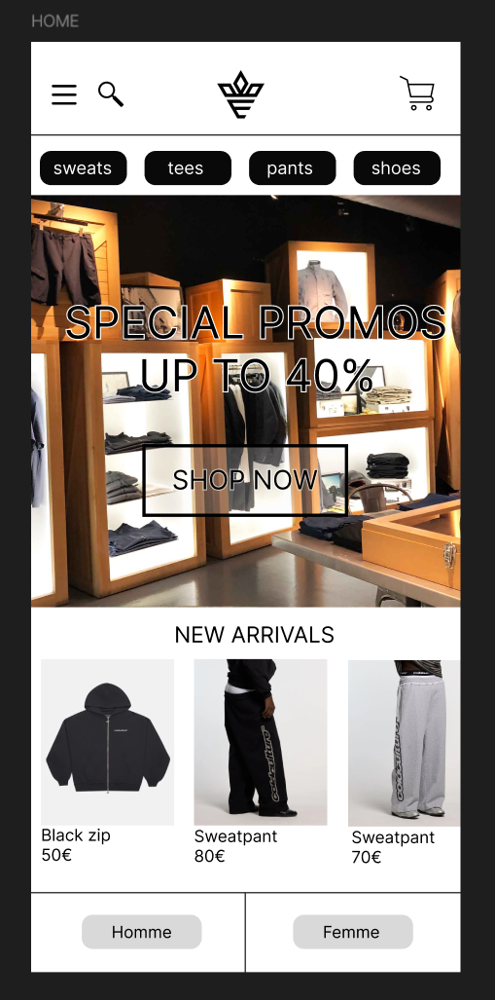
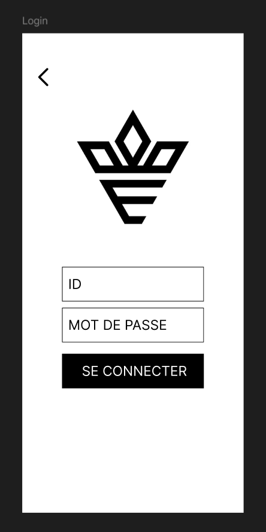
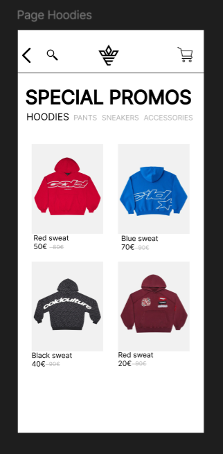
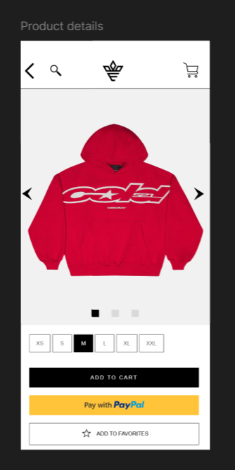

# 📱 Prototype d’application e-commerce mobile
https://www.figma.com/design/4x7XOhiWa5OcMepsL0R5Ji/Ux-Design?node-id=0-1&t=tj0Rhf3svRicpiph-1

## 🎯 Objectif
Concevoir une application e-commerce mobile offrant une expérience utilisateur
fluide, moderne et orientée conversion.

## 🧠 Travail réalisé
- Conception du parcours utilisateur complet
- Création des écrans clés (home, login, catégories, fiche produit, panier, paiement)
- Mise en place d’un prototype interactif (boutons cliquables)
- Réflexion UX mobile-first

## 🔗 Prototype interactif (Figma)
👉 https://www.figma.com/...

## 🖼️ Aperçu des écrans
### Home

### Login

### Liste des produits

### Fiche produit

### Panier

### Confirmation

## 🚀 Évolutions possibles
- Développement frontend (React Native / Flutter)
- Backend (API, base de données produits)
- Analyse des données de vente (Data Analytics)
